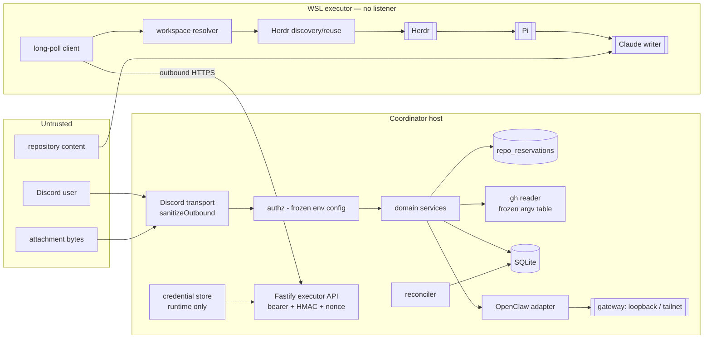
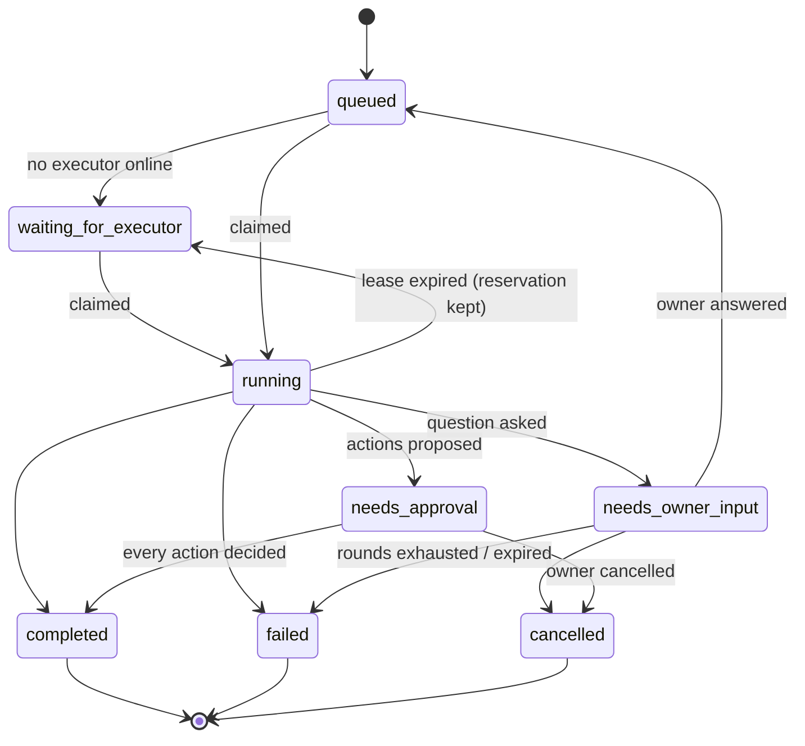
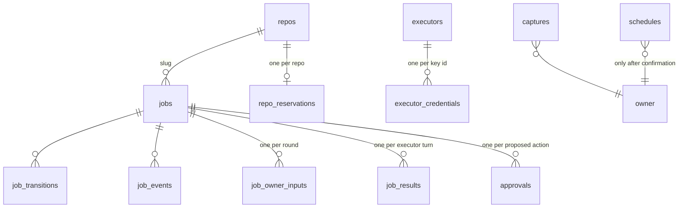

# Architecture

## Components

## Trust boundaries

1. **Discord → coordinator.** Everything is untrusted: text, attachment bytes,
   component ids. Validated at the edge; `repo` is a slug, never a path; no
   Discord string reaches a shell.
2. **Executor → coordinator.** Bearer token (verifier in the database) plus an
   HMAC signature over the raw body, a timestamp, and a single-use nonce.
   Identity is trusted; content is not — everything is redacted and bounded
   before it is stored or shown.
3. **Coordinator → OpenClaw.** Loopback or tailnet only, enforced in code at
   construction and again at startup.
4. **Executor → Herdr/Pi.** Same-user local trust; Pi documents that it has no
   sandbox. Containment is the allowlist, the fail-closed bootstrap policy,
   argv-only subprocesses, bounded timeouts and layered writer guards — not
   isolation.
5. **Repository content → Claude.** Prompt injection is assumed possible. The
   approval gate is the control.
6. **WSL has no inbound surface.** Asserted by a test.

## Job lifecycle

Every transition writes a `job_transitions` row with a reason and an actor
(`owner:<id>`, `executor:<id>`, `system:<component>`).

## Single-writer guarantees and their lifetimes

Four guards, each with a deliberately different span:

| Guard | Scope | Held from | Released on |
|---|---|---|---|
| `repo_reservations` row (primary key on `repo_slug`) | per repo, coordinator | successful claim | terminal transition, in the same transaction; or reconciler expiry |
| Lease (`lease_id`, `lease_expires_at`) | per job | claim | result, cancel-ack, requeue, or expiry |
| Filesystem lock (`O_EXCL`) | per repo, executor host | just before a Pi turn | when that turn ends, **including before reporting `needs_owner_input`** |
| Herdr agent-name uniqueness | per host | `agent start` | agent exit |

The **reservation** — not `state = 'running'` — is the claim predicate, so it
spans `running`, `needs_owner_input` and `needs_approval`. A paused job keeps
holding its repository, which is what stops a second job from starting a writer
beside a workspace that still has uncommitted changes. The primary key makes a
double reservation structurally impossible rather than predicate-dependent.

Because the filesystem lock is released *before* `needs_owner_input` is
reported, that state is genuinely quiescent: no live writer, so cancelling it is
immediate and safe.

## Reservation TTLs and expiry outcomes

`expires_at` is recomputed on every transition:

| State | TTL |
|---|---|
| `running`, `waiting_for_executor`, `queued` | 24 h, refreshed by every job heartbeat |
| `needs_owner_input` | 24 h |
| `needs_approval` | approval TTL + 1 h, so the normal approval path always runs first |
| `reason = 'orphan_agent'` | never expires; owner-cleared only |

| State at expiry | Outcome |
|---|---|
| `needs_owner_input` | → `failed` / `owner_input_expired`, workspace retained, a later answer refused |
| `needs_approval` | → `completed` / `approvals_expired_reservation`, actions expired, result preserved |
| `orphan_agent` | never expires — `/job cleanup` only |

## Crash recovery

A lease can expire while a Ducky-owned Pi agent is still working. Handing the
repository to another job would create a second writer, so instead:

- the reconciler moves the job to `waiting_for_executor`, **keeps** the
  reservation, and sets `recovery_required`;
- on the next claim the executor inspects the recorded agent read-only and
  branches:

| Observed | Action |
|---|---|
| absent | normal path: discover, else create |
| `idle` / `done` | read the existing `result.json` first — a finished turn whose report was lost is submitted, not re-run |
| `working` | **reattach and poll**, never restart; on timeout fail closed as `orphan_agent_still_working` |
| `blocked` | never answered automatically; `orphan_agent_blocked` |
| ownership unprovable | touch nothing; `foreign_agent_conflict` |

Ownership requires **all three**: the `ducky-pi-` agent-name prefix, the
`ducky-mgd:` workspace label, and a row in `herdr_workspaces` — the last being
authoritative. This host already has a user workspace labelled exactly `ducky`,
so a label alone proves nothing.

## Data model

`job_results` holds one immutable row per executor turn, keyed by
`(job_id, lease_id)`, with the sanitized snapshot and the proposed actions. An
`AFTER UPDATE` trigger aborts any attempt to mutate it. Approvals are derived
rows; the snapshot is the record of truth.

`schedules` is the only table that ever holds schedule content, and only after
explicit confirmation — pending previews live in memory alone.

## Decisions

See [decisions/README.md](decisions/README.md).
