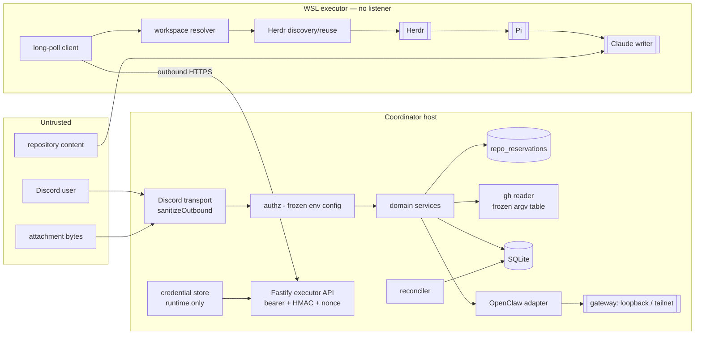
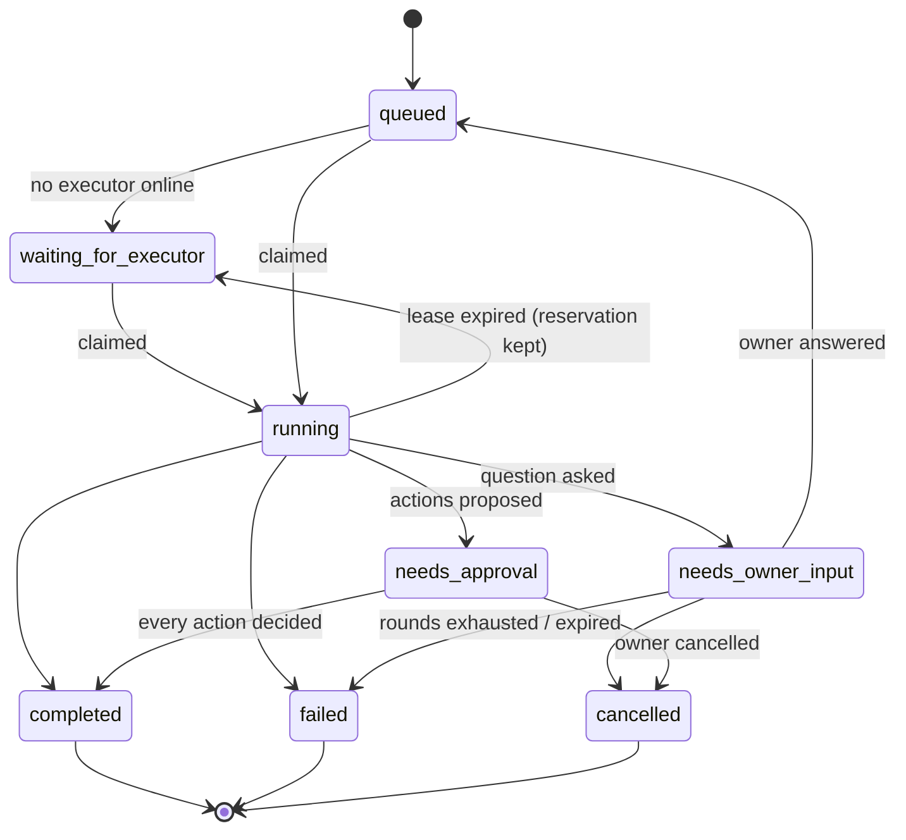
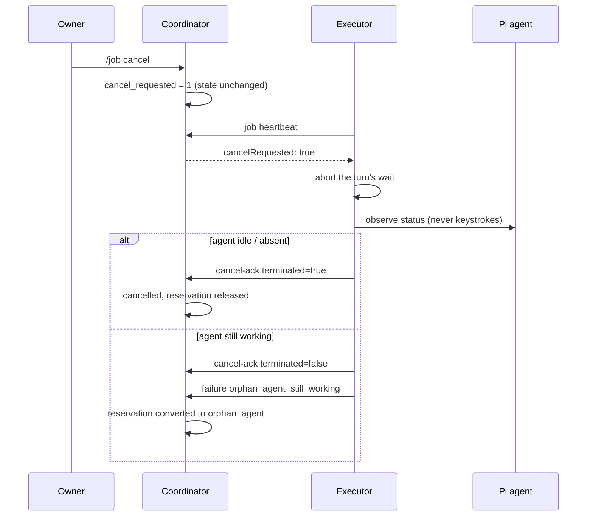
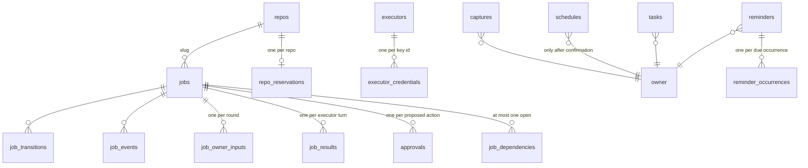
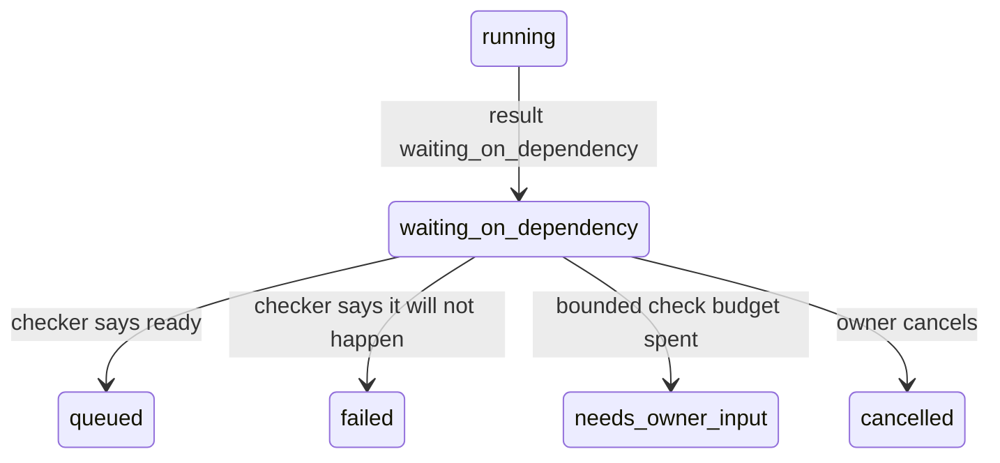

# Architecture

## Components

## Trust boundaries

1. **Discord → coordinator.** Everything is untrusted: text, attachment bytes,
   component ids. Validated at the edge; `repo` is a slug, never a path; no
   Discord string reaches a shell.
2. **Executor → coordinator.** Bearer token (verifier in the database) plus an
   HMAC signature over the raw body, a timestamp, and a single-use nonce.
   Identity is trusted; content is not — everything is redacted and bounded
   before it is stored or shown.
3. **Coordinator → OpenClaw.** Loopback or tailnet only, enforced in code at
   construction and again at startup.
4. **Executor → Herdr/Pi.** Same-user local trust; Pi documents that it has no
   sandbox. Containment is the allowlist, the fail-closed bootstrap policy,
   argv-only subprocesses, bounded timeouts and layered writer guards — not
   isolation.
5. **Repository content → Claude.** Prompt injection is assumed possible. The
   approval gate is the control.
6. **WSL has no inbound surface.** Asserted by a test.

## Job lifecycle

Every transition writes a `job_transitions` row with a reason and an actor
(`owner:<id>`, `executor:<id>`, `system:<component>`).

## Single-writer guarantees and their lifetimes

Four guards, each with a deliberately different span:

| Guard | Scope | Held from | Released on |
|---|---|---|---|
| `repo_reservations` row (primary key on `repo_slug`) | per repo, coordinator | successful claim | terminal transition, in the same transaction; or reconciler expiry |
| Lease (`lease_id`, `lease_expires_at`) | per job | claim | result, cancel-ack, requeue, or expiry |
| Filesystem lock (`O_EXCL`) | per repo, executor host | just before a Pi turn | when that turn ends, **including before reporting `needs_owner_input`** |
| Herdr agent-name uniqueness | per host | `agent start` | agent exit |

The **reservation** — not `state = 'running'` — is the claim predicate, so it
spans `running`, `needs_owner_input` and `needs_approval`. A paused job keeps
holding its repository, which is what stops a second job from starting a writer
beside a workspace that still has uncommitted changes. The primary key makes a
double reservation structurally impossible rather than predicate-dependent.

Because the filesystem lock is released *before* `needs_owner_input` is
reported, that state is genuinely quiescent: no live writer, so cancelling it is
immediate and safe.

## Reservation TTLs and expiry outcomes

`expires_at` is recomputed on every transition:

| State | TTL |
|---|---|
| `running`, `waiting_for_executor`, `queued` | 24 h, refreshed by every job heartbeat |
| `needs_owner_input` | 24 h |
| `needs_approval` | approval TTL + 1 h, so the normal approval path always runs first |
| `reason = 'orphan_agent'` | never expires; owner-cleared only |

| State at expiry | Outcome |
|---|---|
| `needs_owner_input` | → `failed` / `owner_input_expired`, workspace retained, a later answer refused |
| `needs_approval` | → `completed` / `approvals_expired_reservation`, actions expired, result preserved |
| `orphan_agent` | never expires — `/job cleanup` only |

## Cancelling a running job

A claimed job is supervised: the executor heartbeats its lease and watches for
a cancellation the owner requested after the claim.

The orchestration is **raced** against the signal rather than awaited first: a
real turn is a blocking `herdr agent prompt --wait`, so waiting it out would
mean a cancellation only landed after the wall-clock timeout.

Herdr offers no verified way to interrupt a Pi turn without risking a
half-written edit, so nothing is ever typed into a live pane. Termination is
only ever *reported* when it is *observed* — a false positive here would
release the repository while a writer was still running. The executor's writer
lock is likewise held until a stop is confirmed, so a retry on that host cannot
start a second writer beside a live agent.

## Workspace cleanup

A workspace is closed only after a **terminal success**. A job awaiting an
owner answer or an approval keeps its workspace, so the work stays inspectable
and the next round can reuse the same Pi session; a failed or orphaned job
keeps it for the owner to look at.

Cleanup proves ownership again at the point of closing — the workspace must be
the one recorded for that job and carry the Ducky label, and a still-working
agent blocks the close — so a user's workspace can never be closed even if a
wrong id reached it.

## Durable workspace ownership

The executor registers a workspace with the coordinator as soon as it exists
and **before** any agent is started in it. Without that record, an executor
crash between creation and the first prompt would leave a live Ducky agent that
the next claim could not recognise — it would report `foreign_agent_conflict`
and release the reservation underneath it.

Registration is idempotent, lease-checked, and refuses to re-point a workspace
at a different job. A conflict reported while we hold a registered workspace
converts the reservation to `orphan_agent` rather than releasing it.

## Crash recovery

A lease can expire while a Ducky-owned Pi agent is still working. Handing the
repository to another job would create a second writer, so instead:

- the reconciler moves the job to `waiting_for_executor`, **keeps** the
  reservation, and sets `recovery_required`;
- on the next claim the executor inspects the recorded agent read-only and
  branches:

| Observed | Action |
|---|---|
| absent | normal path: discover, else create |
| `idle` / `done` | read the existing `result.json` first — a finished turn whose report was lost is submitted, not re-run |
| `working` | **reattach and poll**, never restart; on timeout fail closed as `orphan_agent_still_working` |
| `blocked` | never answered automatically; `orphan_agent_blocked` |
| ownership unprovable | touch nothing; `foreign_agent_conflict` |

Ownership requires **all three**: the `ducky-pi-` agent-name prefix, the
`ducky-mgd:` workspace label, and a row in `herdr_workspaces` — the last being
authoritative. This host already has a user workspace labelled exactly `ducky`,
so a label alone proves nothing.

## Data model

`job_results` holds one immutable row per executor turn, keyed by
`(job_id, lease_id)`, with the sanitized snapshot and the proposed actions. An
`AFTER UPDATE` trigger aborts any attempt to mutate it. Approvals are derived
rows; the snapshot is the record of truth.

`schedules` is the only table that ever holds schedule content, and only after
explicit confirmation — pending previews live in memory alone. Its `starts_at`
holds the wall-clock text the owner typed rather than a UTC instant, and is
read back as a wall clock in the configured owner timezone; it is never
rewritten (see [decisions/0014](decisions/0014-single-owner-timezone-as-a-projection.md)).

`tasks` and `reminders` are the daily assistant's records, owner-only in full
with no shared projection. `reminder_occurrences` is the durable delivery
outbox: one row per occurrence that has come due, unique on
`(reminder_id, occurrence_no)`, carrying `delivered_at`, an attempt count and
an `abandoned_at`. It is the same shape as `job_notification_deliveries` and
for the same reason — recording a delivery must be idempotent, and a failure
must be retryable without being re-sendable.

`reminders.next_fire_at` is the single scheduling cursor. Materializing an
occurrence and advancing that cursor happen in one transaction guarded by a
compare-and-set on `fired_count`, which is what makes a repeated or overlapping
tick advance a recurrence exactly once. Recurrence is bounded by construction:
`interval_minutes` with `max_occurrences`, enforced by CHECK constraints, and
there is no cron column
(see [decisions/0013](decisions/0013-bounded-reminder-recurrence-and-catch-up.md)).

## Work phases and dependency waits

`jobs.state` says who owns a job and what may touch it. `jobs.work_phase` --
`preparing`, `planning`, `implementing`, `reviewing`, `fixing`, `verifying` --
says what the agent is doing. They are **orthogonal on purpose**: every
single-writer guarantee (the partial unique index, the lease-expiry sweep, the
supervised cancel branch, the claim predicate) is keyed on
`state = 'running'`, and `running` is still the ONLY lease-bearing state.
Splitting it into six would have meant rewriting all of them
(see [decisions/0016](decisions/0016-work-phases-dependency-waits-and-audit.md)).

A phase is set on claim, moved by an allowlisted `phase` on the executor's job
heartbeat, validated against an exhaustive phase machine, idempotent for a
repeated report, and **cleared** whenever the job stops being lease-bearing --
so a paused job can never render a stale phase.

`waiting_on_dependency` IS a real state, because it has behaviour nothing else
has: **the lease is released and the repository reservation is retained.**
Nothing is being written, so a lease would only look stalled to the sweep; but
the job has already worked in that repository and expects to resume, so nothing
else may start there.

`job_dependencies` is the schedule: a closed type enum, a `next_check_at`
cursor, and TWO independent ceilings (`max_checks` and `deadline_at`). The
schema requires a waiting row to have a cursor and a resolved one not to, so
"is anything still being polled?" is a fact of the row. The dependency, the
result snapshot and the transition are one transaction.

`DependencyResolver` rides the **existing coordinator interval** -- no second
scheduler and no per-dependency timer -- with a bounded batch, a
compare-and-set on the check count, bounded exponential backoff and a
re-entrancy guard. A checker that throws still spends a check, so a broken one
cannot buy unlimited retries.

**The shipped checker never reports ready.** `UnavailableDependencyChecker`
answers `pending` for everything, because nothing on this host can observe a CI
run or a registry. A wait therefore expires to `needs_owner_input` rather than
being resumed on a check that did not happen, and a `ready` from an unverified
checker is downgraded rather than believed.

## Command policy

`COMMAND_POLICY` classifies every `gh`, `git` and `herdr` operation as
`read_only`, `local_mutation`, `external_mutation` or `high_risk`. The ceiling
in this phase is `local_mutation`, asserted by a test over the whole table.

Two independent gates: the frozen argv table decides what can be
*constructed*, `checkCommandAllowed` decides whether what was constructed may
*run*. An unclassified command is refused rather than allowed by default, and
`FORBIDDEN_COMMAND_VERBS` (`push`, `reset`, `clean`, `rm`, `exec`, `auth`, …)
is checked first and independently of the table.

## The audit log

`audit_log` is a structured RECORD and never an authority. It is written from
`JobsRepo.transition` -- the single point of state change, so coverage is
structural -- plus creation, claim, phase change, cancellation, failure,
approval decisions, executor connect/offline and every dependency event.

Nothing reads it to decide anything, asserted by a test. It holds no secret, no
raw authentication material, no terminal output and no environment; the owner
is recorded as the role `owner` rather than a Discord id, because there is
exactly one and the id would be unnecessary personal data in a long-lived
table. Details are redacted and clamped, recording never throws, and the
reconciler prunes past the retention window so the table stays bounded.

## The assistant tick

The daily assistant has **no scheduler of its own**. `ReminderNotifier.tick()`
runs on the coordinator's existing interval, beside `Reconciler.run()` and
`JobNotifier.deliverPending()`, and each of the three is isolated: a failure in
one never blocks the others. A tick materializes what has come due, then
delivers what is outstanding, and is re-entrancy guarded so two overlapping
passes cannot both read an occurrence as undelivered.

The consequence is a worst-case reminder lateness of one
`DUCKY_RECONCILE_INTERVAL_MS`, visible in configuration rather than hidden in a
timer table, and nothing scheduled in memory to be lost on restart.

## Decisions

See [decisions/README.md](decisions/README.md).
